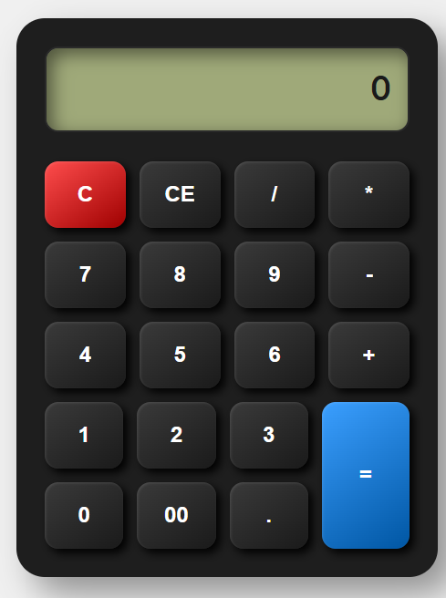

# 🧮 Advanced Calculator Web App

A modern and interactive calculator built using **HTML, CSS, and JavaScript**.
This project focuses on both **functionality and UI design**, providing a smooth experience similar to real-world calculators.

---

## 📸 Project Preview

<p align="center">
  
</p>

---

## 🚀 Features

* ➕ Basic arithmetic operations (+, −, ×, ÷, %)
* ⌨️ Full keyboard support
* 🧹 AC (All Clear) and CE (Clear Entry) functionality
* 🔢 Supports multi-digit inputs (including "00")
* ⚡ Real-time result calculation
* 🎨 Modern UI with **box-shadow (depth & neumorphism effect)**
* 📱 Clean and responsive layout
* 🔘 Interactive button hover effects

---

## 🎨 UI & Design Highlights

* Designed using **CSS Grid layout**
* Applied **box-shadow effects** for realistic button depth
* Clean and minimal **calculator display screen**
* Styled buttons with:

  * Rounded edges
  * Color differentiation (C, operators, =)
  * Hover animations

---

## 🛠️ Technologies Used

* **HTML5** → Structure of the calculator
* **CSS3** → Styling (Grid, Box Shadow, UI Effects)
* **JavaScript (Vanilla JS)** → Logic & DOM Manipulation

---

## 📂 Project Structure

```
simple-calculator/
│── index.html
│── style.css
└── script.js
```

---

## ⚙️ How It Works

* User input is taken via **button clicks and keyboard events**
* Values are displayed dynamically using **DOM manipulation**
* Expressions are evaluated using JavaScript logic
* Includes **basic error handling** for invalid inputs

---

## 🌐 Live Demo

👉 https://anjanajanardhanan-hub.github.io/calculator/

---

## 📌 Future Improvements

* Scientific calculator features
* Calculation history
* Sound effects & animations
* Mobile-first UI enhancements

---

## 👩‍💻 Author

**Anjana Janardhanan**
BCA (AI & ML) Student

---

## ⭐ Support

If you like this project, consider giving it a ⭐ on GitHub!
